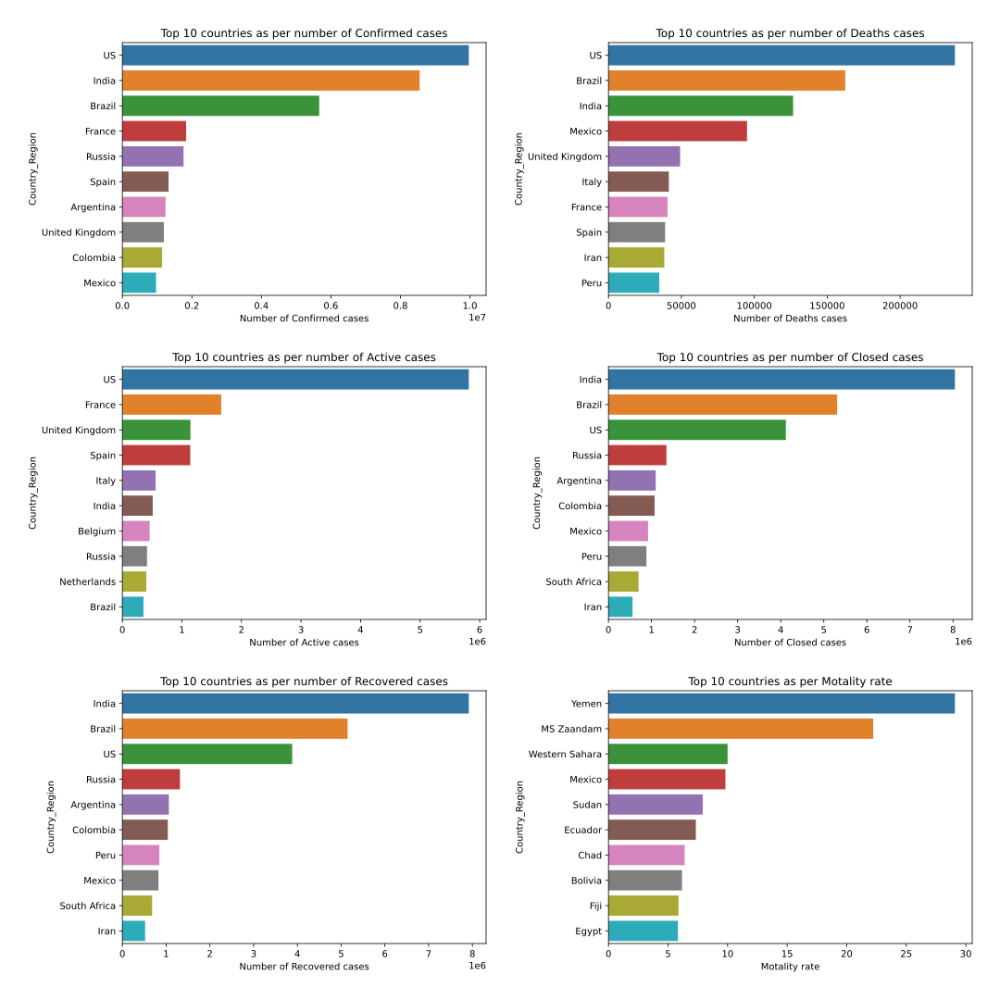
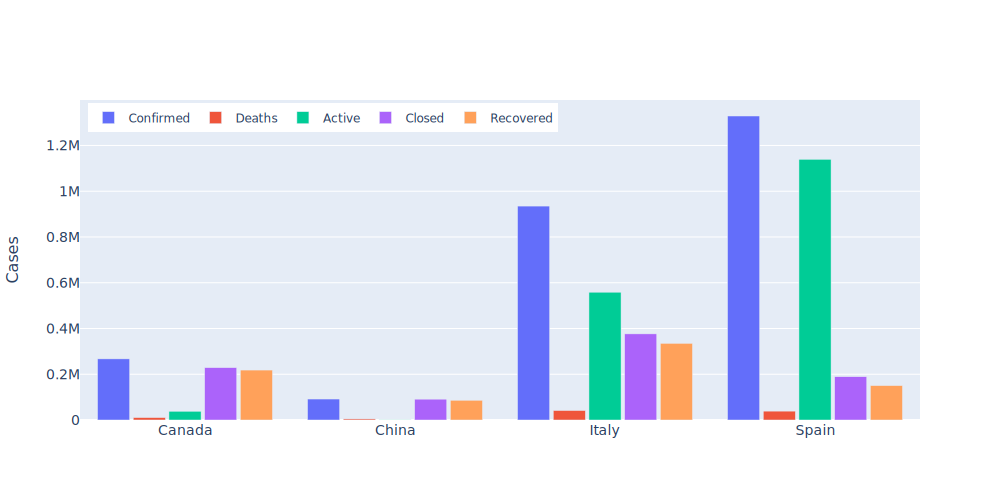
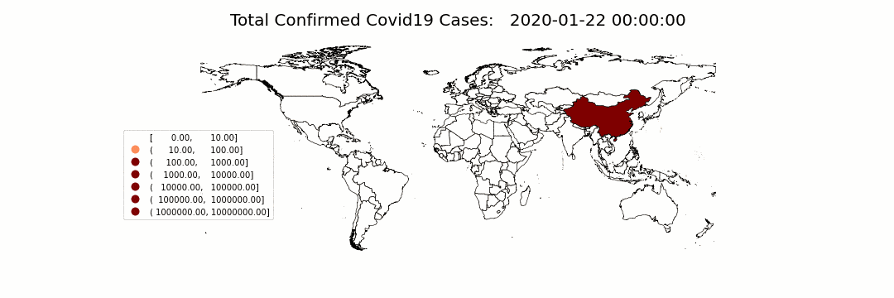
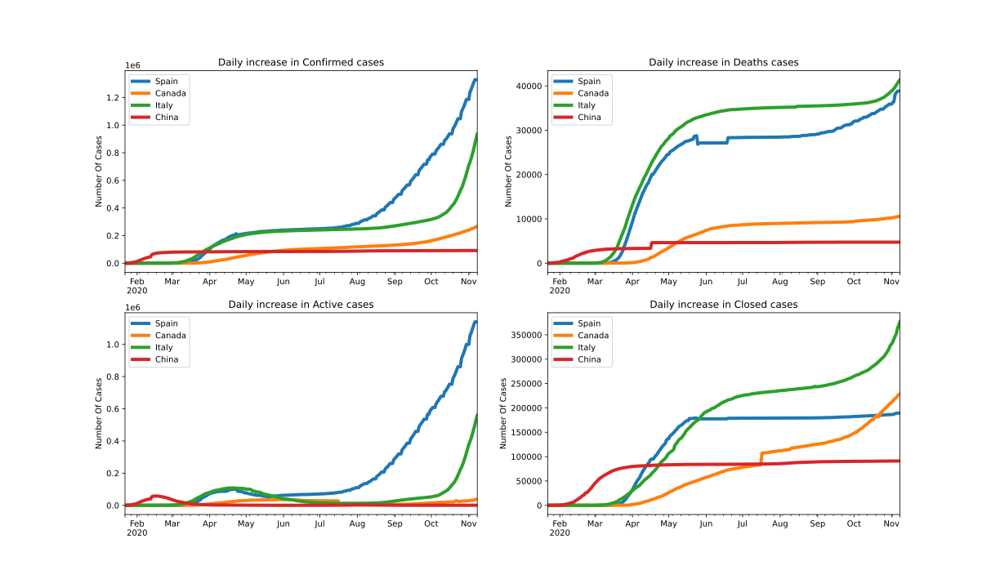
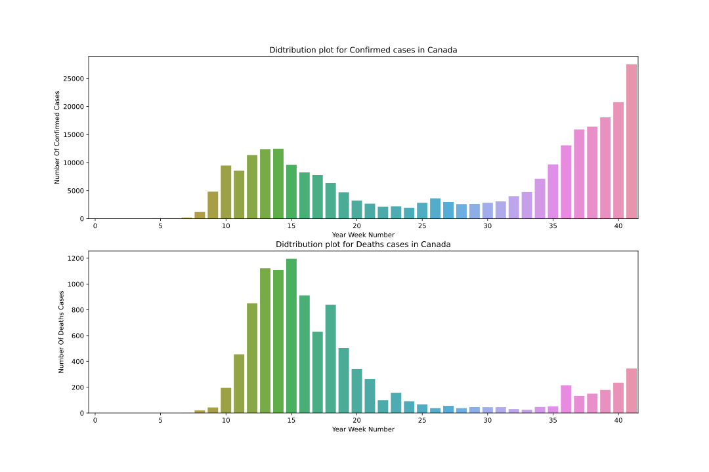
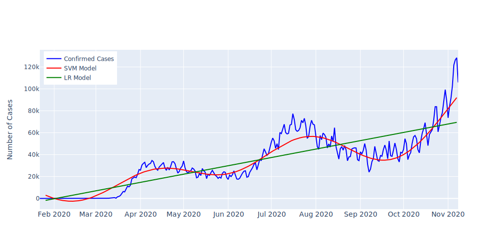

<p align="center">
  
</p>

# TP5: Librairies scientifiques et graphiques

- [Directives particulières](#directives-particuli%C3%A8res)
- [Introduction](#introduction)
- [Partie 1: Importer et manipuler les bases de données](#partie-1-Importer-et-manipuler-les-bases-de-donn%C3%A9es)
- [Partie 2: Analyse des données](#partie-2-analyse-des-donn%C3%A9es)
- [Partie 3: Modélisation et prévision](#partie-3-mod%C3%A9lisation-et-pr%C3%A9vision)
- [Annexe: Guide et normes de codage](#annexe-guide-et-normes-de-codage)

:alarm_clock: [Date de remise le Dimanche 22 novembre 23h59](https://www.timeanddate.com/countdown/generic?iso=20201122T235959&p0=165&msg=Remise+TP5&font=cursive)

## Directives particulières

  
* Pas de librairies externes autres que celles déjà importées.
  
* <p align="justify"> Dans chaque programme, vous pouvez ajouter d’autres fonctions à celles décrites dans l’énoncé, ainsi que d’autres structures (et sous-structures), pour améliorer la lisibilité et suivre le principe **DRY** (Don’t Repeat Yourself). À chaque endroit où vous remarquez une duplication de code (vous avez écrit les mêmes opérations plus d’une fois) et qu’il n’est pas possible de l’éliminer avec ce qui a été vu en cours, indiquez-le en commentaire.</p>

* <p align="justify"> Afin de vous inciter à écrire du code de qualité, on vous demande d'utiliser les **normes de codage** vue dans le TP3. </p>


## Introduction
<p align="justify">
L’analyse des données fait partie des disciplines les plus prisées de nos jours. Outil stratégique au sein des organisations, elle permet entre autres de mieux comprendre des événements qui se produisent avec les facteurs qui les favorisent, ou encore de mesurer l’impact d’une opération ou d’une politique grâce à des indicateurs de performance. Dans ce laboratoire, nous essayons de mieux comprendre l’évolution de la pandémie du nouveau coronavirus Covid-19 au Canada et dans les pays les plus touchés.</p>

## Partie 1: Importer et manipuler les bases de données
<p align="justify">
L'une des bases de données la plus largement utilisées aujourd'hui fournissant des données liées au Covid-19 est celle fournie par le Centre de science et d'ingénierie des systèmes de l'université John Hopkins, auquel il est possible d'accéder sur GitHub. </p>

### 1.1. Import des bases de données:
<p align="justify">
L'ensemble de données peuvent être directement importé dans des bases de données avec la méthode read_csv de la bibliothèque Pandas. Télécharger les bases de données et les manipuler après n’est pas toujours une bonne pratique, il est préférable d'utiliser les liens qui pointent vers les fichiers CSV archivés sur GitHub, car à mesure que la situation change, il devient plus facile de charger et d'actualiser l'analyse avec de nouvelles données.</p>

<p align="justify">
Durant ce laboratoire, on va travailler avec quatre bases de données, dont les liens URL sont stockés dans la variable: add_death_df, add_confirmed_df, add_recovered_df et add_summary_df.</p>

```python
add_path         = 'https://raw.githubusercontent.com/CSSEGISandData/COVID-19/master/csse_covid_19_data/';
add_death_df     = add_path + 'csse_covid_19_time_series/time_series_covid19_deaths_global.csv'
add_confirmed_df = add_path + 'csse_covid_19_time_series/time_series_covid19_confirmed_global.csv'
add_recovered_df = add_path + 'csse_covid_19_time_series/time_series_covid19_recovered_global.csv'
add_summury_df   = 'https://raw.githubusercontent.com/CSSEGISandData/COVID-19/web-data/data/cases_country.csv'
```
<p align="justify">
La première étape du laboratoire consiste à importer les quatre bases de données. Pour cela on va utiliser la fonction <strong>Load_df(...).</strong> Cette fonction a pour objectif d’importer et créer les quatres bases de données à partir des liens URL reçus en paramètre.</p>

```python
[death_df, confirmed_df,recovered_df, summury_df] = Load_df(add_death_df, add_confirmed_df, 
                                                            add_recovered_df, add_summury_df)
```
<p align="justify">
Une fois l’importation des bases de données est effectuée, on doit nous assurer que l’opération s’est bien déroulée. Pour cela on va afficher les 10 premiers éléments de chaque base de données. Vous trouveriez ci-dessous un aperçu du résultat attendu.</p>

```python
death_df.head(10)
```

<table border="1" class="dataframe" font-size=5pt>
  <thead>
    <tr style="text-align: right;">
      <th></th>
      <th>Province/State</th>
      <th>Country/Region</th>
      <th>Lat</th>
      <th>Long</th>
      <th>1/22/20</th>
      <th>1/23/20</th>
      <th>1/24/20</th>
      <th>1/25/20</th>
      <th>1/26/20</th>
      <th>1/27/20</th>
      <th>...</th>
      <th>10/6/20</th>
      <th>10/7/20</th>
      <th>10/8/20</th>
      <th>10/9/20</th>
      <th>10/10/20</th>
      <th>10/11/20</th>
      <th>10/12/20</th>
      <th>10/13/20</th>
      <th>10/14/20</th>
      <th>10/15/20</th>
    </tr>
  </thead>
  <tbody>
    <tr>
      <th>0</th>
      <td>NaN</td>
      <td>Afghanistan</td>
      <td>33.93911</td>
      <td>67.709953</td>
      <td>0</td>
      <td>0</td>
      <td>0</td>
      <td>0</td>
      <td>0</td>
      <td>0</td>
      <td>...</td>
      <td>1467</td>
      <td>1469</td>
      <td>1470</td>
      <td>1472</td>
      <td>1473</td>
      <td>1477</td>
      <td>1479</td>
      <td>1480</td>
      <td>1481</td>
      <td>1481</td>
    </tr>
    <tr>
      <th>1</th>
      <td>NaN</td>
      <td>Albania</td>
      <td>41.15330</td>
      <td>20.168300</td>
      <td>0</td>
      <td>0</td>
      <td>0</td>
      <td>0</td>
      <td>0</td>
      <td>0</td>
      <td>...</td>
      <td>403</td>
      <td>407</td>
      <td>411</td>
      <td>413</td>
      <td>416</td>
      <td>420</td>
      <td>424</td>
      <td>429</td>
      <td>434</td>
      <td>439</td>
    </tr>
    <tr>
      <th>2</th>
      <td>NaN</td>
      <td>Algeria</td>
      <td>28.03390</td>
      <td>1.659600</td>
      <td>0</td>
      <td>0</td>
      <td>0</td>
      <td>0</td>
      <td>0</td>
      <td>0</td>
      <td>...</td>
      <td>1768</td>
      <td>1771</td>
      <td>1783</td>
      <td>1789</td>
      <td>1795</td>
      <td>1801</td>
      <td>1809</td>
      <td>1818</td>
      <td>1827</td>
      <td>1827</td>
    </tr>
    <tr>
      <th>3</th>
      <td>NaN</td>
      <td>Andorra</td>
      <td>42.50630</td>
      <td>1.521800</td>
      <td>0</td>
      <td>0</td>
      <td>0</td>
      <td>0</td>
      <td>0</td>
      <td>0</td>
      <td>...</td>
      <td>53</td>
      <td>53</td>
      <td>54</td>
      <td>55</td>
      <td>55</td>
      <td>55</td>
      <td>57</td>
      <td>57</td>
      <td>59</td>
      <td>59</td>
    </tr>
    <tr>
      <th>4</th>
      <td>NaN</td>
      <td>Angola</td>
      <td>-11.20270</td>
      <td>17.873900</td>
      <td>0</td>
      <td>0</td>
      <td>0</td>
      <td>0</td>
      <td>0</td>
      <td>0</td>
      <td>...</td>
      <td>211</td>
      <td>211</td>
      <td>208</td>
      <td>212</td>
      <td>218</td>
      <td>218</td>
      <td>219</td>
      <td>222</td>
      <td>227</td>
      <td>228</td>
    </tr>
    <tr>
      <th>5</th>
      <td>NaN</td>
      <td>Antigua and Barbuda</td>
      <td>17.06080</td>
      <td>-61.796400</td>
      <td>0</td>
      <td>0</td>
      <td>0</td>
      <td>0</td>
      <td>0</td>
      <td>0</td>
      <td>...</td>
      <td>3</td>
      <td>3</td>
      <td>3</td>
      <td>3</td>
      <td>3</td>
      <td>3</td>
      <td>3</td>
      <td>3</td>
      <td>3</td>
      <td>3</td>
    </tr>
    <tr>
      <th>6</th>
      <td>NaN</td>
      <td>Argentina</td>
      <td>-38.41610</td>
      <td>-63.616700</td>
      <td>0</td>
      <td>0</td>
      <td>0</td>
      <td>0</td>
      <td>0</td>
      <td>0</td>
      <td>...</td>
      <td>21827</td>
      <td>22226</td>
      <td>22710</td>
      <td>23225</td>
      <td>23581</td>
      <td>23868</td>
      <td>24186</td>
      <td>24572</td>
      <td>24921</td>
      <td>25342</td>
    </tr>
    <tr>
      <th>7</th>
      <td>NaN</td>
      <td>Armenia</td>
      <td>40.06910</td>
      <td>45.038200</td>
      <td>0</td>
      <td>0</td>
      <td>0</td>
      <td>0</td>
      <td>0</td>
      <td>0</td>
      <td>...</td>
      <td>990</td>
      <td>995</td>
      <td>1004</td>
      <td>1010</td>
      <td>1016</td>
      <td>1020</td>
      <td>1026</td>
      <td>1032</td>
      <td>1039</td>
      <td>1046</td>
    </tr>
    <tr>
      <th>8</th>
      <td>Australian Capital Territory</td>
      <td>Australia</td>
      <td>-35.47350</td>
      <td>149.012400</td>
      <td>0</td>
      <td>0</td>
      <td>0</td>
      <td>0</td>
      <td>0</td>
      <td>0</td>
      <td>...</td>
      <td>3</td>
      <td>3</td>
      <td>3</td>
      <td>3</td>
      <td>3</td>
      <td>3</td>
      <td>3</td>
      <td>3</td>
      <td>3</td>
      <td>3</td>
    </tr>
    <tr>
      <th>9</th>
      <td>New South Wales</td>
      <td>Australia</td>
      <td>-33.86880</td>
      <td>151.209300</td>
      <td>0</td>
      <td>0</td>
      <td>0</td>
      <td>0</td>
      <td>0</td>
      <td>0</td>
      <td>...</td>
      <td>53</td>
      <td>53</td>
      <td>53</td>
      <td>53</td>
      <td>53</td>
      <td>53</td>
      <td>53</td>
      <td>53</td>
      <td>53</td>
      <td>53</td>
    </tr>
  </tbody>
</table>

```python
confirmed_df.head(10)
```
<table border="1" class="dataframe">
  <thead>
    <tr style="text-align: right;">
      <th></th>
      <th>Province/State</th>
      <th>Country/Region</th>
      <th>Lat</th>
      <th>Long</th>
      <th>1/22/20</th>
      <th>1/23/20</th>
      <th>1/24/20</th>
      <th>1/25/20</th>
      <th>1/26/20</th>
      <th>1/27/20</th>
      <th>...</th>
      <th>10/6/20</th>
      <th>10/7/20</th>
      <th>10/8/20</th>
      <th>10/9/20</th>
      <th>10/10/20</th>
      <th>10/11/20</th>
      <th>10/12/20</th>
      <th>10/13/20</th>
      <th>10/14/20</th>
      <th>10/15/20</th>
    </tr>
  </thead>
  <tbody>
    <tr>
      <th>0</th>
      <td>NaN</td>
      <td>Afghanistan</td>
      <td>33.93911</td>
      <td>67.709953</td>
      <td>0</td>
      <td>0</td>
      <td>0</td>
      <td>0</td>
      <td>0</td>
      <td>0</td>
      <td>...</td>
      <td>39486</td>
      <td>39548</td>
      <td>39616</td>
      <td>39693</td>
      <td>39703</td>
      <td>39799</td>
      <td>39870</td>
      <td>39928</td>
      <td>39994</td>
      <td>40026</td>
    </tr>
    <tr>
      <th>1</th>
      <td>NaN</td>
      <td>Albania</td>
      <td>41.15330</td>
      <td>20.168300</td>
      <td>0</td>
      <td>0</td>
      <td>0</td>
      <td>0</td>
      <td>0</td>
      <td>0</td>
      <td>...</td>
      <td>14568</td>
      <td>14730</td>
      <td>14899</td>
      <td>15066</td>
      <td>15231</td>
      <td>15399</td>
      <td>15570</td>
      <td>15752</td>
      <td>15955</td>
      <td>16212</td>
    </tr>
    <tr>
      <th>2</th>
      <td>NaN</td>
      <td>Algeria</td>
      <td>28.03390</td>
      <td>1.659600</td>
      <td>0</td>
      <td>0</td>
      <td>0</td>
      <td>0</td>
      <td>0</td>
      <td>0</td>
      <td>...</td>
      <td>52399</td>
      <td>52520</td>
      <td>52658</td>
      <td>52804</td>
      <td>52940</td>
      <td>53072</td>
      <td>53325</td>
      <td>53399</td>
      <td>53584</td>
      <td>53777</td>
    </tr>
    <tr>
      <th>3</th>
      <td>NaN</td>
      <td>Andorra</td>
      <td>42.50630</td>
      <td>1.521800</td>
      <td>0</td>
      <td>0</td>
      <td>0</td>
      <td>0</td>
      <td>0</td>
      <td>0</td>
      <td>...</td>
      <td>2370</td>
      <td>2568</td>
      <td>2568</td>
      <td>2696</td>
      <td>2696</td>
      <td>2696</td>
      <td>2995</td>
      <td>2995</td>
      <td>3190</td>
      <td>3190</td>
    </tr>
    <tr>
      <th>4</th>
      <td>NaN</td>
      <td>Angola</td>
      <td>-11.20270</td>
      <td>17.873900</td>
      <td>0</td>
      <td>0</td>
      <td>0</td>
      <td>0</td>
      <td>0</td>
      <td>0</td>
      <td>...</td>
      <td>5725</td>
      <td>5725</td>
      <td>5958</td>
      <td>6031</td>
      <td>6246</td>
      <td>6366</td>
      <td>6488</td>
      <td>6680</td>
      <td>6846</td>
      <td>7096</td>
    </tr>
    <tr>
      <th>5</th>
      <td>NaN</td>
      <td>Antigua and Barbuda</td>
      <td>17.06080</td>
      <td>-61.796400</td>
      <td>0</td>
      <td>0</td>
      <td>0</td>
      <td>0</td>
      <td>0</td>
      <td>0</td>
      <td>...</td>
      <td>107</td>
      <td>108</td>
      <td>111</td>
      <td>111</td>
      <td>111</td>
      <td>111</td>
      <td>111</td>
      <td>111</td>
      <td>112</td>
      <td>112</td>
    </tr>
    <tr>
      <th>6</th>
      <td>NaN</td>
      <td>Argentina</td>
      <td>-38.41610</td>
      <td>-63.616700</td>
      <td>0</td>
      <td>0</td>
      <td>0</td>
      <td>0</td>
      <td>0</td>
      <td>0</td>
      <td>...</td>
      <td>824468</td>
      <td>840915</td>
      <td>856369</td>
      <td>871468</td>
      <td>883882</td>
      <td>894206</td>
      <td>903730</td>
      <td>917035</td>
      <td>931967</td>
      <td>949063</td>
    </tr>
    <tr>
      <th>7</th>
      <td>NaN</td>
      <td>Armenia</td>
      <td>40.06910</td>
      <td>45.038200</td>
      <td>0</td>
      <td>0</td>
      <td>0</td>
      <td>0</td>
      <td>0</td>
      <td>0</td>
      <td>...</td>
      <td>53083</td>
      <td>53755</td>
      <td>54473</td>
      <td>55087</td>
      <td>55736</td>
      <td>56451</td>
      <td>56821</td>
      <td>57566</td>
      <td>58624</td>
      <td>59995</td>
    </tr>
    <tr>
      <th>8</th>
      <td>Australian Capital Territory</td>
      <td>Australia</td>
      <td>-35.47350</td>
      <td>149.012400</td>
      <td>0</td>
      <td>0</td>
      <td>0</td>
      <td>0</td>
      <td>0</td>
      <td>0</td>
      <td>...</td>
      <td>113</td>
      <td>113</td>
      <td>113</td>
      <td>113</td>
      <td>113</td>
      <td>113</td>
      <td>113</td>
      <td>113</td>
      <td>113</td>
      <td>113</td>
    </tr>
    <tr>
      <th>9</th>
      <td>New South Wales</td>
      <td>Australia</td>
      <td>-33.86880</td>
      <td>151.209300</td>
      <td>0</td>
      <td>0</td>
      <td>0</td>
      <td>0</td>
      <td>3</td>
      <td>4</td>
      <td>...</td>
      <td>4249</td>
      <td>4261</td>
      <td>4271</td>
      <td>4273</td>
      <td>4278</td>
      <td>4284</td>
      <td>4295</td>
      <td>4310</td>
      <td>4321</td>
      <td>4326</td>
    </tr>
  </tbody>
</table>

```python
recovered_df.head(10)
```

<table border="1" class="dataframe">
  <thead>
    <tr style="text-align: right;">
      <th></th>
      <th>Province/State</th>
      <th>Country/Region</th>
      <th>Lat</th>
      <th>Long</th>
      <th>1/22/20</th>
      <th>1/23/20</th>
      <th>1/24/20</th>
      <th>1/25/20</th>
      <th>1/26/20</th>
      <th>1/27/20</th>
      <th>...</th>
      <th>10/6/20</th>
      <th>10/7/20</th>
      <th>10/8/20</th>
      <th>10/9/20</th>
      <th>10/10/20</th>
      <th>10/11/20</th>
      <th>10/12/20</th>
      <th>10/13/20</th>
      <th>10/14/20</th>
      <th>10/15/20</th>
    </tr>
  </thead>
  <tbody>
    <tr>
      <th>0</th>
      <td>NaN</td>
      <td>Afghanistan</td>
      <td>33.93911</td>
      <td>67.709953</td>
      <td>0</td>
      <td>0</td>
      <td>0</td>
      <td>0</td>
      <td>0</td>
      <td>0</td>
      <td>...</td>
      <td>32977</td>
      <td>33045</td>
      <td>33058</td>
      <td>33058</td>
      <td>33064</td>
      <td>33114</td>
      <td>33118</td>
      <td>33308</td>
      <td>33354</td>
      <td>33447</td>
    </tr>
    <tr>
      <th>1</th>
      <td>NaN</td>
      <td>Albania</td>
      <td>41.15330</td>
      <td>20.168300</td>
      <td>0</td>
      <td>0</td>
      <td>0</td>
      <td>0</td>
      <td>0</td>
      <td>0</td>
      <td>...</td>
      <td>8965</td>
      <td>9115</td>
      <td>9215</td>
      <td>9304</td>
      <td>9406</td>
      <td>9500</td>
      <td>9585</td>
      <td>9675</td>
      <td>9762</td>
      <td>9864</td>
    </tr>
    <tr>
      <th>2</th>
      <td>NaN</td>
      <td>Algeria</td>
      <td>28.03390</td>
      <td>1.659600</td>
      <td>0</td>
      <td>0</td>
      <td>0</td>
      <td>0</td>
      <td>0</td>
      <td>0</td>
      <td>...</td>
      <td>36763</td>
      <td>36857</td>
      <td>36958</td>
      <td>37067</td>
      <td>37170</td>
      <td>37170</td>
      <td>37382</td>
      <td>37492</td>
      <td>37603</td>
      <td>37603</td>
    </tr>
    <tr>
      <th>3</th>
      <td>NaN</td>
      <td>Andorra</td>
      <td>42.50630</td>
      <td>1.521800</td>
      <td>0</td>
      <td>0</td>
      <td>0</td>
      <td>0</td>
      <td>0</td>
      <td>0</td>
      <td>...</td>
      <td>1615</td>
      <td>1715</td>
      <td>1715</td>
      <td>1814</td>
      <td>1814</td>
      <td>1814</td>
      <td>1928</td>
      <td>1928</td>
      <td>2011</td>
      <td>2011</td>
    </tr>
    <tr>
      <th>4</th>
      <td>NaN</td>
      <td>Angola</td>
      <td>-11.20270</td>
      <td>17.873900</td>
      <td>0</td>
      <td>0</td>
      <td>0</td>
      <td>0</td>
      <td>0</td>
      <td>0</td>
      <td>...</td>
      <td>2598</td>
      <td>2598</td>
      <td>2635</td>
      <td>2685</td>
      <td>2716</td>
      <td>2743</td>
      <td>2744</td>
      <td>2761</td>
      <td>2801</td>
      <td>2928</td>
    </tr>
    <tr>
      <th>5</th>
      <td>NaN</td>
      <td>Antigua and Barbuda</td>
      <td>17.06080</td>
      <td>-61.796400</td>
      <td>0</td>
      <td>0</td>
      <td>0</td>
      <td>0</td>
      <td>0</td>
      <td>0</td>
      <td>...</td>
      <td>96</td>
      <td>97</td>
      <td>97</td>
      <td>97</td>
      <td>97</td>
      <td>97</td>
      <td>97</td>
      <td>97</td>
      <td>100</td>
      <td>100</td>
    </tr>
    <tr>
      <th>6</th>
      <td>NaN</td>
      <td>Argentina</td>
      <td>-38.41610</td>
      <td>-63.616700</td>
      <td>0</td>
      <td>0</td>
      <td>0</td>
      <td>0</td>
      <td>0</td>
      <td>0</td>
      <td>...</td>
      <td>660272</td>
      <td>670725</td>
      <td>684844</td>
      <td>697141</td>
      <td>709464</td>
      <td>721380</td>
      <td>732582</td>
      <td>742235</td>
      <td>751146</td>
      <td>764859</td>
    </tr>
    <tr>
      <th>7</th>
      <td>NaN</td>
      <td>Armenia</td>
      <td>40.06910</td>
      <td>45.038200</td>
      <td>0</td>
      <td>0</td>
      <td>0</td>
      <td>0</td>
      <td>0</td>
      <td>0</td>
      <td>...</td>
      <td>44932</td>
      <td>45110</td>
      <td>45312</td>
      <td>45528</td>
      <td>45771</td>
      <td>45824</td>
      <td>45891</td>
      <td>46318</td>
      <td>46713</td>
      <td>47119</td>
    </tr>
    <tr>
      <th>8</th>
      <td>Australian Capital Territory</td>
      <td>Australia</td>
      <td>-35.47350</td>
      <td>149.012400</td>
      <td>0</td>
      <td>0</td>
      <td>0</td>
      <td>0</td>
      <td>0</td>
      <td>0</td>
      <td>...</td>
      <td>110</td>
      <td>110</td>
      <td>110</td>
      <td>110</td>
      <td>110</td>
      <td>110</td>
      <td>110</td>
      <td>110</td>
      <td>110</td>
      <td>110</td>
    </tr>
    <tr>
      <th>9</th>
      <td>New South Wales</td>
      <td>Australia</td>
      <td>-33.86880</td>
      <td>151.209300</td>
      <td>0</td>
      <td>0</td>
      <td>0</td>
      <td>0</td>
      <td>0</td>
      <td>0</td>
      <td>...</td>
      <td>3131</td>
      <td>3133</td>
      <td>3132</td>
      <td>3132</td>
      <td>3132</td>
      <td>3134</td>
      <td>3134</td>
      <td>3140</td>
      <td>3140</td>
      <td>3142</td>
    </tr>
  </tbody>
</table>

```python
summary_df.head(10)
```
<table border="1" class="dataframe">
  <thead>
    <tr style="text-align: right;">
      <th></th>
      <th>Country_Region</th>
      <th>Last_Update</th>
      <th>Lat</th>
      <th>Long_</th>
      <th>Confirmed</th>
      <th>Deaths</th>
      <th>Recovered</th>
      <th>Active</th>
      <th>Incident_Rate</th>
      <th>People_Tested</th>
      <th>People_Hospitalized</th>
      <th>Mortality_Rate</th>
      <th>UID</th>
      <th>ISO3</th>
    </tr>
  </thead>
  <tbody>
    <tr>
      <th>0</th>
      <td>Afghanistan</td>
      <td>2020-10-16 16:24:04</td>
      <td>33.93911</td>
      <td>67.709953</td>
      <td>40073.0</td>
      <td>1485.0</td>
      <td>33516.0</td>
      <td>5072.0</td>
      <td>102.940426</td>
      <td>NaN</td>
      <td>NaN</td>
      <td>3.705737</td>
      <td>4</td>
      <td>AFG</td>
    </tr>
    <tr>
      <th>1</th>
      <td>Albania</td>
      <td>2020-10-16 16:24:04</td>
      <td>41.15330</td>
      <td>20.168300</td>
      <td>16501.0</td>
      <td>443.0</td>
      <td>9957.0</td>
      <td>6101.0</td>
      <td>573.389395</td>
      <td>NaN</td>
      <td>NaN</td>
      <td>2.684686</td>
      <td>8</td>
      <td>ALB</td>
    </tr>
    <tr>
      <th>2</th>
      <td>Algeria</td>
      <td>2020-10-16 16:24:04</td>
      <td>28.03390</td>
      <td>1.659600</td>
      <td>53777.0</td>
      <td>1827.0</td>
      <td>37603.0</td>
      <td>14347.0</td>
      <td>122.635624</td>
      <td>NaN</td>
      <td>NaN</td>
      <td>3.397363</td>
      <td>12</td>
      <td>DZA</td>
    </tr>
    <tr>
      <th>3</th>
      <td>Andorra</td>
      <td>2020-10-16 16:24:04</td>
      <td>42.50630</td>
      <td>1.521800</td>
      <td>3377.0</td>
      <td>59.0</td>
      <td>2057.0</td>
      <td>1261.0</td>
      <td>4370.672361</td>
      <td>NaN</td>
      <td>NaN</td>
      <td>1.747113</td>
      <td>20</td>
      <td>AND</td>
    </tr>
    <tr>
      <th>4</th>
      <td>Angola</td>
      <td>2020-10-16 16:24:04</td>
      <td>-11.20270</td>
      <td>17.873900</td>
      <td>7096.0</td>
      <td>228.0</td>
      <td>2928.0</td>
      <td>3940.0</td>
      <td>21.590526</td>
      <td>NaN</td>
      <td>NaN</td>
      <td>3.213078</td>
      <td>24</td>
      <td>AGO</td>
    </tr>
    <tr>
      <th>5</th>
      <td>Antigua and Barbuda</td>
      <td>2020-10-16 16:24:04</td>
      <td>17.06080</td>
      <td>-61.796400</td>
      <td>112.0</td>
      <td>3.0</td>
      <td>100.0</td>
      <td>9.0</td>
      <td>114.369741</td>
      <td>NaN</td>
      <td>NaN</td>
      <td>2.678571</td>
      <td>28</td>
      <td>ATG</td>
    </tr>
    <tr>
      <th>6</th>
      <td>Argentina</td>
      <td>2020-10-16 16:24:04</td>
      <td>-38.41610</td>
      <td>-63.616700</td>
      <td>949063.0</td>
      <td>25342.0</td>
      <td>764859.0</td>
      <td>158862.0</td>
      <td>2099.893094</td>
      <td>NaN</td>
      <td>NaN</td>
      <td>2.670213</td>
      <td>32</td>
      <td>ARG</td>
    </tr>
    <tr>
      <th>7</th>
      <td>Armenia</td>
      <td>2020-10-16 16:24:04</td>
      <td>40.06910</td>
      <td>45.038200</td>
      <td>61460.0</td>
      <td>1056.0</td>
      <td>47541.0</td>
      <td>12863.0</td>
      <td>2074.085273</td>
      <td>NaN</td>
      <td>NaN</td>
      <td>1.718191</td>
      <td>51</td>
      <td>ARM</td>
    </tr>
    <tr>
      <th>8</th>
      <td>Australia</td>
      <td>2020-10-16 16:24:04</td>
      <td>-25.00000</td>
      <td>133.000000</td>
      <td>27371.0</td>
      <td>904.0</td>
      <td>25089.0</td>
      <td>1378.0</td>
      <td>107.507158</td>
      <td>NaN</td>
      <td>NaN</td>
      <td>3.302766</td>
      <td>36</td>
      <td>AUS</td>
    </tr>
    <tr>
      <th>9</th>
      <td>Austria</td>
      <td>2020-10-16 16:24:04</td>
      <td>47.51620</td>
      <td>14.550100</td>
      <td>61387.0</td>
      <td>882.0</td>
      <td>47618.0</td>
      <td>12887.0</td>
      <td>681.593089</td>
      <td>NaN</td>
      <td>NaN</td>
      <td>1.436786</td>
      <td>40</td>
      <td>AUT</td>
    </tr>
  </tbody>
</table>


### 1.2. Prétraitement des données:
<p align="justify">
Au vu de la diversité des sources, les formats des données diffèrent souvent les uns des autres, et ne sont pas toujours compréhensibles ni utiles à l’état brut. À cet effet, le prétraitement s’avère être une étape fondamentale de toute exploration de données, et  sa réussite dépend considérablement de la qualité des résultats de l’analyse proprement dite. Dans cette partie du laboratoire, nous effectuerons quelques transformations et filtres afin de nous focaliser sur l’essentiel et d’en obtenir un format compréhensible et peu fastidieux à analyser. </p>

Les bases de données importées précédemment se divisent en deux catégories :
1. Sommaire mondial des nombres de cas confirmé, mort, actif et rétabli (summary_df).
2. Évolution mondiale des nombres de cas confirmé mort et rétabli (death_df, confirmed_df et recovered_df).

#### 1.2.1. Prétraitement des données mondial:
<p align="justify">
La première transformation qu’on va apporter à la base de données summary_df, consiste à ajouter une colonne au nom de <strong>"Closed"</strong>, qui correspond au nombre de cas fermé dans chaque pays. Pour cela on va utiliser la fonction <strong>summaryaddcol(...)</strong>, qui ajoute une colonne à la base de données df reçue en paramètre, le nom et la valeur de cette colonne se trouve respectivement dans les variables col et value. La fonction retourne la nouvelle base de données.</p>

```python
summary_df = Data_Processing.summaryaddcol(summary_df, "Closed", summary_df["Deaths"] + summary_df["Recovered"])
summary_df.head(10)
```

<table border="1" class="dataframe">
  <thead>
    <tr style="text-align: right;">
      <th></th>
      <th>Country_Region</th>
      <th>Last_Update</th>
      <th>Lat</th>
      <th>Long_</th>
      <th>Confirmed</th>
      <th>Deaths</th>
      <th>Recovered</th>
      <th>Active</th>
      <th>Incident_Rate</th>
      <th>People_Tested</th>
      <th>People_Hospitalized</th>
      <th>Mortality_Rate</th>
      <th>UID</th>
      <th>ISO3</th>
      <th>Closed</th>
    </tr>
  </thead>
  <tbody>
    <tr>
      <th>0</th>
      <td>Afghanistan</td>
      <td>2020-10-16 16:24:04</td>
      <td>33.93911</td>
      <td>67.709953</td>
      <td>40073.0</td>
      <td>1485.0</td>
      <td>33516.0</td>
      <td>5072.0</td>
      <td>102.940426</td>
      <td>NaN</td>
      <td>NaN</td>
      <td>3.705737</td>
      <td>4</td>
      <td>AFG</td>
      <td>35001.0</td>
    </tr>
    <tr>
      <th>1</th>
      <td>Albania</td>
      <td>2020-10-16 16:24:04</td>
      <td>41.15330</td>
      <td>20.168300</td>
      <td>16501.0</td>
      <td>443.0</td>
      <td>9957.0</td>
      <td>6101.0</td>
      <td>573.389395</td>
      <td>NaN</td>
      <td>NaN</td>
      <td>2.684686</td>
      <td>8</td>
      <td>ALB</td>
      <td>10400.0</td>
    </tr>
    <tr>
      <th>2</th>
      <td>Algeria</td>
      <td>2020-10-16 16:24:04</td>
      <td>28.03390</td>
      <td>1.659600</td>
      <td>53777.0</td>
      <td>1827.0</td>
      <td>37603.0</td>
      <td>14347.0</td>
      <td>122.635624</td>
      <td>NaN</td>
      <td>NaN</td>
      <td>3.397363</td>
      <td>12</td>
      <td>DZA</td>
      <td>39430.0</td>
    </tr>
    <tr>
      <th>3</th>
      <td>Andorra</td>
      <td>2020-10-16 16:24:04</td>
      <td>42.50630</td>
      <td>1.521800</td>
      <td>3377.0</td>
      <td>59.0</td>
      <td>2057.0</td>
      <td>1261.0</td>
      <td>4370.672361</td>
      <td>NaN</td>
      <td>NaN</td>
      <td>1.747113</td>
      <td>20</td>
      <td>AND</td>
      <td>2116.0</td>
    </tr>
    <tr>
      <th>4</th>
      <td>Angola</td>
      <td>2020-10-16 16:24:04</td>
      <td>-11.20270</td>
      <td>17.873900</td>
      <td>7096.0</td>
      <td>228.0</td>
      <td>2928.0</td>
      <td>3940.0</td>
      <td>21.590526</td>
      <td>NaN</td>
      <td>NaN</td>
      <td>3.213078</td>
      <td>24</td>
      <td>AGO</td>
      <td>3156.0</td>
    </tr>
    <tr>
      <th>5</th>
      <td>Antigua and Barbuda</td>
      <td>2020-10-16 16:24:04</td>
      <td>17.06080</td>
      <td>-61.796400</td>
      <td>112.0</td>
      <td>3.0</td>
      <td>100.0</td>
      <td>9.0</td>
      <td>114.369741</td>
      <td>NaN</td>
      <td>NaN</td>
      <td>2.678571</td>
      <td>28</td>
      <td>ATG</td>
      <td>103.0</td>
    </tr>
    <tr>
      <th>6</th>
      <td>Argentina</td>
      <td>2020-10-16 16:24:04</td>
      <td>-38.41610</td>
      <td>-63.616700</td>
      <td>949063.0</td>
      <td>25342.0</td>
      <td>764859.0</td>
      <td>158862.0</td>
      <td>2099.893094</td>
      <td>NaN</td>
      <td>NaN</td>
      <td>2.670213</td>
      <td>32</td>
      <td>ARG</td>
      <td>790201.0</td>
    </tr>
    <tr>
      <th>7</th>
      <td>Armenia</td>
      <td>2020-10-16 16:24:04</td>
      <td>40.06910</td>
      <td>45.038200</td>
      <td>61460.0</td>
      <td>1056.0</td>
      <td>47541.0</td>
      <td>12863.0</td>
      <td>2074.085273</td>
      <td>NaN</td>
      <td>NaN</td>
      <td>1.718191</td>
      <td>51</td>
      <td>ARM</td>
      <td>48597.0</td>
    </tr>
    <tr>
      <th>8</th>
      <td>Australia</td>
      <td>2020-10-16 16:24:04</td>
      <td>-25.00000</td>
      <td>133.000000</td>
      <td>27371.0</td>
      <td>904.0</td>
      <td>25089.0</td>
      <td>1378.0</td>
      <td>107.507158</td>
      <td>NaN</td>
      <td>NaN</td>
      <td>3.302766</td>
      <td>36</td>
      <td>AUS</td>
      <td>25993.0</td>
    </tr>
    <tr>
      <th>9</th>
      <td>Austria</td>
      <td>2020-10-16 16:24:04</td>
      <td>47.51620</td>
      <td>14.550100</td>
      <td>61387.0</td>
      <td>882.0</td>
      <td>47618.0</td>
      <td>12887.0</td>
      <td>681.593089</td>
      <td>NaN</td>
      <td>NaN</td>
      <td>1.436786</td>
      <td>40</td>
      <td>AUT</td>
      <td>48500.0</td>
    </tr>
  </tbody>
</table>

<p align="justify">
Les colonnes <strong>Last_Update, Lat, Long_, Incident_Rate, People_Tested, People_Hospitalized, UID	et ISO3</strong>, ne nous seront pas utiles dans notre analyse. Afin de garder que les colonnes qui vont être utile pour notre analyse on va utiliser la fonction <strong>summaryextractcol(...)</strong>, qui extrait les colonnes reçues en paramètre à partir de la base de données summary_df. La fonction retourne la base de données filtrée.</p>

```python
columns = ["Country_Region", "Confirmed", "Deaths", "Active", "Closed", "Recovered", "Mortality_Rate"]
summary_df = Data_Processing.summaryextractcol(summary_df, columns)
summary_df.head(10)
```
<table border="1" class="dataframe">
  <thead>
    <tr style="text-align: right;">
      <th></th>
      <th>Country_Region</th>
      <th>Confirmed</th>
      <th>Deaths</th>
      <th>Active</th>
      <th>Closed</th>
      <th>Recovered</th>
      <th>Mortality_Rate</th>
    </tr>
  </thead>
  <tbody>
    <tr>
      <th>0</th>
      <td>Afghanistan</td>
      <td>40073.0</td>
      <td>1485.0</td>
      <td>5072.0</td>
      <td>35001.0</td>
      <td>33516.0</td>
      <td>3.705737</td>
    </tr>
    <tr>
      <th>1</th>
      <td>Albania</td>
      <td>16501.0</td>
      <td>443.0</td>
      <td>6101.0</td>
      <td>10400.0</td>
      <td>9957.0</td>
      <td>2.684686</td>
    </tr>
    <tr>
      <th>2</th>
      <td>Algeria</td>
      <td>53777.0</td>
      <td>1827.0</td>
      <td>14347.0</td>
      <td>39430.0</td>
      <td>37603.0</td>
      <td>3.397363</td>
    </tr>
    <tr>
      <th>3</th>
      <td>Andorra</td>
      <td>3377.0</td>
      <td>59.0</td>
      <td>1261.0</td>
      <td>2116.0</td>
      <td>2057.0</td>
      <td>1.747113</td>
    </tr>
    <tr>
      <th>4</th>
      <td>Angola</td>
      <td>7096.0</td>
      <td>228.0</td>
      <td>3940.0</td>
      <td>3156.0</td>
      <td>2928.0</td>
      <td>3.213078</td>
    </tr>
    <tr>
      <th>5</th>
      <td>Antigua and Barbuda</td>
      <td>112.0</td>
      <td>3.0</td>
      <td>9.0</td>
      <td>103.0</td>
      <td>100.0</td>
      <td>2.678571</td>
    </tr>
    <tr>
      <th>6</th>
      <td>Argentina</td>
      <td>949063.0</td>
      <td>25342.0</td>
      <td>158862.0</td>
      <td>790201.0</td>
      <td>764859.0</td>
      <td>2.670213</td>
    </tr>
    <tr>
      <th>7</th>
      <td>Armenia</td>
      <td>61460.0</td>
      <td>1056.0</td>
      <td>12863.0</td>
      <td>48597.0</td>
      <td>47541.0</td>
      <td>1.718191</td>
    </tr>
    <tr>
      <th>8</th>
      <td>Australia</td>
      <td>27371.0</td>
      <td>904.0</td>
      <td>1378.0</td>
      <td>25993.0</td>
      <td>25089.0</td>
      <td>3.302766</td>
    </tr>
    <tr>
      <th>9</th>
      <td>Austria</td>
      <td>61387.0</td>
      <td>882.0</td>
      <td>12887.0</td>
      <td>48500.0</td>
      <td>47618.0</td>
      <td>1.436786</td>
    </tr>
  </tbody>
</table>

<p align="justify">
Afin de faire une observation en fonction des pays, il nous faut regrouper notre base de données en fonction des pays. Pour cela on va utiliser la fonction <strong>summarybycountry(...)</strong>. Pensez à utiliser la méthode groupby().</p>

```python
summary_df_by_country = Data_Processing.summarybycountry(summary_df)
summary_df_by_country.head(10)
```
<table border="1" class="dataframe">
  <thead>
    <tr style="text-align: right;">
      <th></th>
      <th>Confirmed</th>
      <th>Deaths</th>
      <th>Active</th>
      <th>Closed</th>
      <th>Recovered</th>
      <th>Mortality_Rate</th>
    </tr>
    <tr>
      <th>Country_Region</th>
      <th></th>
      <th></th>
      <th></th>
      <th></th>
      <th></th>
      <th></th>
    </tr>
  </thead>
  <tbody>
    <tr>
      <th>Afghanistan</th>
      <td>40073.0</td>
      <td>1485.0</td>
      <td>5072.0</td>
      <td>35001.0</td>
      <td>33516.0</td>
      <td>3.705737</td>
    </tr>
    <tr>
      <th>Albania</th>
      <td>16501.0</td>
      <td>443.0</td>
      <td>6101.0</td>
      <td>10400.0</td>
      <td>9957.0</td>
      <td>2.684686</td>
    </tr>
    <tr>
      <th>Algeria</th>
      <td>53777.0</td>
      <td>1827.0</td>
      <td>14347.0</td>
      <td>39430.0</td>
      <td>37603.0</td>
      <td>3.397363</td>
    </tr>
    <tr>
      <th>Andorra</th>
      <td>3377.0</td>
      <td>59.0</td>
      <td>1261.0</td>
      <td>2116.0</td>
      <td>2057.0</td>
      <td>1.747113</td>
    </tr>
    <tr>
      <th>Angola</th>
      <td>7096.0</td>
      <td>228.0</td>
      <td>3940.0</td>
      <td>3156.0</td>
      <td>2928.0</td>
      <td>3.213078</td>
    </tr>
    <tr>
      <th>Antigua and Barbuda</th>
      <td>112.0</td>
      <td>3.0</td>
      <td>9.0</td>
      <td>103.0</td>
      <td>100.0</td>
      <td>2.678571</td>
    </tr>
    <tr>
      <th>Argentina</th>
      <td>949063.0</td>
      <td>25342.0</td>
      <td>158862.0</td>
      <td>790201.0</td>
      <td>764859.0</td>
      <td>2.670213</td>
    </tr>
    <tr>
      <th>Armenia</th>
      <td>61460.0</td>
      <td>1056.0</td>
      <td>12863.0</td>
      <td>48597.0</td>
      <td>47541.0</td>
      <td>1.718191</td>
    </tr>
    <tr>
      <th>Australia</th>
      <td>27371.0</td>
      <td>904.0</td>
      <td>1378.0</td>
      <td>25993.0</td>
      <td>25089.0</td>
      <td>3.302766</td>
    </tr>
    <tr>
      <th>Austria</th>
      <td>61387.0</td>
      <td>882.0</td>
      <td>12887.0</td>
      <td>48500.0</td>
      <td>47618.0</td>
      <td>1.436786</td>
    </tr>
  </tbody>
</table>

Finalement, la fonction **basicinfsummary(...)** va être utilisée pour afficher un sommaire des nombres de cas confirmé, rétabli, mort, actif et fermée dans le monde.

```python
Data_Processing.basicinfsummary(summary_df)  
```
<p><strong>Basic Information:</strong><br>
    Total number of Confirmed cases around the world:  39068667<br>
    Total number of Recovered cases around the world:  26950302<br>
    Total number of Deaths cases around the world:  1100364<br>
    Total number of Active cases around the world:  11018420<br>
    Total number of Closed cases around the world:  28043974</p>  

#### 1.2.2. Prétraitement des données des Pays:
<p align="justify">
Pour rendre la manipulation des bases de données <strong>death_df, confirmed_df et recovered_df</strong> plus simple, on va créer un dictionnaire de ses bases de données. Pour ce faire, on va utiliser la fonction <strong>creatdictdf(…)</strong> qui va créer un dictionnaire à partir des bases de données reçues en paramètre, avec leurs noms respectifs comme clés.</p>

```python
dict_df = Data_Processing.creatdictdf(death_df,confirmed_df,recovered_df)
dict_df["Confirmed"].head(10)
```

<table border="1" class="dataframe">
  <thead>
    <tr style="text-align: right;">
      <th></th>
      <th>Province/State</th>
      <th>Country/Region</th>
      <th>Lat</th>
      <th>Long</th>
      <th>1/22/20</th>
      <th>1/23/20</th>
      <th>1/24/20</th>
      <th>1/25/20</th>
      <th>1/26/20</th>
      <th>1/27/20</th>
      <th>...</th>
      <th>10/6/20</th>
      <th>10/7/20</th>
      <th>10/8/20</th>
      <th>10/9/20</th>
      <th>10/10/20</th>
      <th>10/11/20</th>
      <th>10/12/20</th>
      <th>10/13/20</th>
      <th>10/14/20</th>
      <th>10/15/20</th>
    </tr>
  </thead>
  <tbody>
    <tr>
      <th>0</th>
      <td>NaN</td>
      <td>Afghanistan</td>
      <td>33.93911</td>
      <td>67.709953</td>
      <td>0</td>
      <td>0</td>
      <td>0</td>
      <td>0</td>
      <td>0</td>
      <td>0</td>
      <td>...</td>
      <td>39486</td>
      <td>39548</td>
      <td>39616</td>
      <td>39693</td>
      <td>39703</td>
      <td>39799</td>
      <td>39870</td>
      <td>39928</td>
      <td>39994</td>
      <td>40026</td>
    </tr>
    <tr>
      <th>1</th>
      <td>NaN</td>
      <td>Albania</td>
      <td>41.15330</td>
      <td>20.168300</td>
      <td>0</td>
      <td>0</td>
      <td>0</td>
      <td>0</td>
      <td>0</td>
      <td>0</td>
      <td>...</td>
      <td>14568</td>
      <td>14730</td>
      <td>14899</td>
      <td>15066</td>
      <td>15231</td>
      <td>15399</td>
      <td>15570</td>
      <td>15752</td>
      <td>15955</td>
      <td>16212</td>
    </tr>
    <tr>
      <th>2</th>
      <td>NaN</td>
      <td>Algeria</td>
      <td>28.03390</td>
      <td>1.659600</td>
      <td>0</td>
      <td>0</td>
      <td>0</td>
      <td>0</td>
      <td>0</td>
      <td>0</td>
      <td>...</td>
      <td>52399</td>
      <td>52520</td>
      <td>52658</td>
      <td>52804</td>
      <td>52940</td>
      <td>53072</td>
      <td>53325</td>
      <td>53399</td>
      <td>53584</td>
      <td>53777</td>
    </tr>
    <tr>
      <th>3</th>
      <td>NaN</td>
      <td>Andorra</td>
      <td>42.50630</td>
      <td>1.521800</td>
      <td>0</td>
      <td>0</td>
      <td>0</td>
      <td>0</td>
      <td>0</td>
      <td>0</td>
      <td>...</td>
      <td>2370</td>
      <td>2568</td>
      <td>2568</td>
      <td>2696</td>
      <td>2696</td>
      <td>2696</td>
      <td>2995</td>
      <td>2995</td>
      <td>3190</td>
      <td>3190</td>
    </tr>
    <tr>
      <th>4</th>
      <td>NaN</td>
      <td>Angola</td>
      <td>-11.20270</td>
      <td>17.873900</td>
      <td>0</td>
      <td>0</td>
      <td>0</td>
      <td>0</td>
      <td>0</td>
      <td>0</td>
      <td>...</td>
      <td>5725</td>
      <td>5725</td>
      <td>5958</td>
      <td>6031</td>
      <td>6246</td>
      <td>6366</td>
      <td>6488</td>
      <td>6680</td>
      <td>6846</td>
      <td>7096</td>
    </tr>
    <tr>
      <th>5</th>
      <td>NaN</td>
      <td>Antigua and Barbuda</td>
      <td>17.06080</td>
      <td>-61.796400</td>
      <td>0</td>
      <td>0</td>
      <td>0</td>
      <td>0</td>
      <td>0</td>
      <td>0</td>
      <td>...</td>
      <td>107</td>
      <td>108</td>
      <td>111</td>
      <td>111</td>
      <td>111</td>
      <td>111</td>
      <td>111</td>
      <td>111</td>
      <td>112</td>
      <td>112</td>
    </tr>
    <tr>
      <th>6</th>
      <td>NaN</td>
      <td>Argentina</td>
      <td>-38.41610</td>
      <td>-63.616700</td>
      <td>0</td>
      <td>0</td>
      <td>0</td>
      <td>0</td>
      <td>0</td>
      <td>0</td>
      <td>...</td>
      <td>824468</td>
      <td>840915</td>
      <td>856369</td>
      <td>871468</td>
      <td>883882</td>
      <td>894206</td>
      <td>903730</td>
      <td>917035</td>
      <td>931967</td>
      <td>949063</td>
    </tr>
    <tr>
      <th>7</th>
      <td>NaN</td>
      <td>Armenia</td>
      <td>40.06910</td>
      <td>45.038200</td>
      <td>0</td>
      <td>0</td>
      <td>0</td>
      <td>0</td>
      <td>0</td>
      <td>0</td>
      <td>...</td>
      <td>53083</td>
      <td>53755</td>
      <td>54473</td>
      <td>55087</td>
      <td>55736</td>
      <td>56451</td>
      <td>56821</td>
      <td>57566</td>
      <td>58624</td>
      <td>59995</td>
    </tr>
    <tr>
      <th>8</th>
      <td>Australian Capital Territory</td>
      <td>Australia</td>
      <td>-35.47350</td>
      <td>149.012400</td>
      <td>0</td>
      <td>0</td>
      <td>0</td>
      <td>0</td>
      <td>0</td>
      <td>0</td>
      <td>...</td>
      <td>113</td>
      <td>113</td>
      <td>113</td>
      <td>113</td>
      <td>113</td>
      <td>113</td>
      <td>113</td>
      <td>113</td>
      <td>113</td>
      <td>113</td>
    </tr>
    <tr>
      <th>9</th>
      <td>New South Wales</td>
      <td>Australia</td>
      <td>-33.86880</td>
      <td>151.209300</td>
      <td>0</td>
      <td>0</td>
      <td>0</td>
      <td>0</td>
      <td>3</td>
      <td>4</td>
      <td>...</td>
      <td>4249</td>
      <td>4261</td>
      <td>4271</td>
      <td>4273</td>
      <td>4278</td>
      <td>4284</td>
      <td>4295</td>
      <td>4310</td>
      <td>4321</td>
      <td>4326</td>
    </tr>
  </tbody>
</table>

<p align="justify">
Les colonnes Province/State, Lat et Long, ne nous seront pas utiles. Afin de garder que les données qui vont être utiles pour notre analyse, on va utiliser la fonction <strong>dictdfremovecol(...)</strong>, qui va supprimer ses colonnes du dictionnaire dict_df, les colonnes doivent être supprimées de l’ensemble des clés du dictionnaire.</p>

```python
dict_df = Data_Processing.dictdfremovecol(dict_df, ["Province/State","Lat","Long"])
dict_df["Deaths"].head(10)
```

<table border="1" class="dataframe">
  <thead>
    <tr style="text-align: right;">
      <th></th>
      <th>Country/Region</th>
      <th>1/22/20</th>
      <th>1/23/20</th>
      <th>1/24/20</th>
      <th>1/25/20</th>
      <th>1/26/20</th>
      <th>1/27/20</th>
      <th>1/28/20</th>
      <th>1/29/20</th>
      <th>1/30/20</th>
      <th>...</th>
      <th>10/6/20</th>
      <th>10/7/20</th>
      <th>10/8/20</th>
      <th>10/9/20</th>
      <th>10/10/20</th>
      <th>10/11/20</th>
      <th>10/12/20</th>
      <th>10/13/20</th>
      <th>10/14/20</th>
      <th>10/15/20</th>
    </tr>
  </thead>
  <tbody>
    <tr>
      <th>0</th>
      <td>Afghanistan</td>
      <td>0</td>
      <td>0</td>
      <td>0</td>
      <td>0</td>
      <td>0</td>
      <td>0</td>
      <td>0</td>
      <td>0</td>
      <td>0</td>
      <td>...</td>
      <td>1467</td>
      <td>1469</td>
      <td>1470</td>
      <td>1472</td>
      <td>1473</td>
      <td>1477</td>
      <td>1479</td>
      <td>1480</td>
      <td>1481</td>
      <td>1481</td>
    </tr>
    <tr>
      <th>1</th>
      <td>Albania</td>
      <td>0</td>
      <td>0</td>
      <td>0</td>
      <td>0</td>
      <td>0</td>
      <td>0</td>
      <td>0</td>
      <td>0</td>
      <td>0</td>
      <td>...</td>
      <td>403</td>
      <td>407</td>
      <td>411</td>
      <td>413</td>
      <td>416</td>
      <td>420</td>
      <td>424</td>
      <td>429</td>
      <td>434</td>
      <td>439</td>
    </tr>
    <tr>
      <th>2</th>
      <td>Algeria</td>
      <td>0</td>
      <td>0</td>
      <td>0</td>
      <td>0</td>
      <td>0</td>
      <td>0</td>
      <td>0</td>
      <td>0</td>
      <td>0</td>
      <td>...</td>
      <td>1768</td>
      <td>1771</td>
      <td>1783</td>
      <td>1789</td>
      <td>1795</td>
      <td>1801</td>
      <td>1809</td>
      <td>1818</td>
      <td>1827</td>
      <td>1827</td>
    </tr>
    <tr>
      <th>3</th>
      <td>Andorra</td>
      <td>0</td>
      <td>0</td>
      <td>0</td>
      <td>0</td>
      <td>0</td>
      <td>0</td>
      <td>0</td>
      <td>0</td>
      <td>0</td>
      <td>...</td>
      <td>53</td>
      <td>53</td>
      <td>54</td>
      <td>55</td>
      <td>55</td>
      <td>55</td>
      <td>57</td>
      <td>57</td>
      <td>59</td>
      <td>59</td>
    </tr>
    <tr>
      <th>4</th>
      <td>Angola</td>
      <td>0</td>
      <td>0</td>
      <td>0</td>
      <td>0</td>
      <td>0</td>
      <td>0</td>
      <td>0</td>
      <td>0</td>
      <td>0</td>
      <td>...</td>
      <td>211</td>
      <td>211</td>
      <td>208</td>
      <td>212</td>
      <td>218</td>
      <td>218</td>
      <td>219</td>
      <td>222</td>
      <td>227</td>
      <td>228</td>
    </tr>
    <tr>
      <th>5</th>
      <td>Antigua and Barbuda</td>
      <td>0</td>
      <td>0</td>
      <td>0</td>
      <td>0</td>
      <td>0</td>
      <td>0</td>
      <td>0</td>
      <td>0</td>
      <td>0</td>
      <td>...</td>
      <td>3</td>
      <td>3</td>
      <td>3</td>
      <td>3</td>
      <td>3</td>
      <td>3</td>
      <td>3</td>
      <td>3</td>
      <td>3</td>
      <td>3</td>
    </tr>
    <tr>
      <th>6</th>
      <td>Argentina</td>
      <td>0</td>
      <td>0</td>
      <td>0</td>
      <td>0</td>
      <td>0</td>
      <td>0</td>
      <td>0</td>
      <td>0</td>
      <td>0</td>
      <td>...</td>
      <td>21827</td>
      <td>22226</td>
      <td>22710</td>
      <td>23225</td>
      <td>23581</td>
      <td>23868</td>
      <td>24186</td>
      <td>24572</td>
      <td>24921</td>
      <td>25342</td>
    </tr>
    <tr>
      <th>7</th>
      <td>Armenia</td>
      <td>0</td>
      <td>0</td>
      <td>0</td>
      <td>0</td>
      <td>0</td>
      <td>0</td>
      <td>0</td>
      <td>0</td>
      <td>0</td>
      <td>...</td>
      <td>990</td>
      <td>995</td>
      <td>1004</td>
      <td>1010</td>
      <td>1016</td>
      <td>1020</td>
      <td>1026</td>
      <td>1032</td>
      <td>1039</td>
      <td>1046</td>
    </tr>
    <tr>
      <th>8</th>
      <td>Australia</td>
      <td>0</td>
      <td>0</td>
      <td>0</td>
      <td>0</td>
      <td>0</td>
      <td>0</td>
      <td>0</td>
      <td>0</td>
      <td>0</td>
      <td>...</td>
      <td>3</td>
      <td>3</td>
      <td>3</td>
      <td>3</td>
      <td>3</td>
      <td>3</td>
      <td>3</td>
      <td>3</td>
      <td>3</td>
      <td>3</td>
    </tr>
    <tr>
      <th>9</th>
      <td>Australia</td>
      <td>0</td>
      <td>0</td>
      <td>0</td>
      <td>0</td>
      <td>0</td>
      <td>0</td>
      <td>0</td>
      <td>0</td>
      <td>0</td>
      <td>...</td>
      <td>53</td>
      <td>53</td>
      <td>53</td>
      <td>53</td>
      <td>53</td>
      <td>53</td>
      <td>53</td>
      <td>53</td>
      <td>53</td>
      <td>53</td>
    </tr>
  </tbody>
</table>

<p align="justify">
Afin de faire une observation en fonction des pays, il nous faut regrouper le dictionnaire dict_df en fonction des pays pour toutes les clés du dictionnaire. Pour cela on va utiliser la fonction <strong>dictdfbycountry(...)</strong>. La fonction <strong>dictdfbycountry(...)</strong> change aussi les colonnes des dates en séries temporelles.</p>

```python
dict_df_by_country = Data_Processing.dictdfbycountry(dict_df)
dict_df_by_country["Recovered"].head(10)
```

<table border="1" class="dataframe">
  <thead>
    <tr style="text-align: right;">
      <th></th>
      <th>2020-01-22</th>
      <th>2020-01-23</th>
      <th>2020-01-24</th>
      <th>2020-01-25</th>
      <th>2020-01-26</th>
      <th>2020-01-27</th>
      <th>2020-01-28</th>
      <th>2020-01-29</th>
      <th>2020-01-30</th>
      <th>2020-01-31</th>
      <th>...</th>
      <th>2020-10-06</th>
      <th>2020-10-07</th>
      <th>2020-10-08</th>
      <th>2020-10-09</th>
      <th>2020-10-10</th>
      <th>2020-10-11</th>
      <th>2020-10-12</th>
      <th>2020-10-13</th>
      <th>2020-10-14</th>
      <th>2020-10-15</th>
    </tr>
    <tr>
      <th>Country/Region</th>
      <th></th>
      <th></th>
      <th></th>
      <th></th>
      <th></th>
      <th></th>
      <th></th>
      <th></th>
      <th></th>
      <th></th>
      <th></th>
      <th></th>
      <th></th>
      <th></th>
      <th></th>
      <th></th>
      <th></th>
      <th></th>
      <th></th>
      <th></th>
      <th></th>
    </tr>
  </thead>
  <tbody>
    <tr>
      <th>Afghanistan</th>
      <td>0</td>
      <td>0</td>
      <td>0</td>
      <td>0</td>
      <td>0</td>
      <td>0</td>
      <td>0</td>
      <td>0</td>
      <td>0</td>
      <td>0</td>
      <td>...</td>
      <td>32977</td>
      <td>33045</td>
      <td>33058</td>
      <td>33058</td>
      <td>33064</td>
      <td>33114</td>
      <td>33118</td>
      <td>33308</td>
      <td>33354</td>
      <td>33447</td>
    </tr>
    <tr>
      <th>Albania</th>
      <td>0</td>
      <td>0</td>
      <td>0</td>
      <td>0</td>
      <td>0</td>
      <td>0</td>
      <td>0</td>
      <td>0</td>
      <td>0</td>
      <td>0</td>
      <td>...</td>
      <td>8965</td>
      <td>9115</td>
      <td>9215</td>
      <td>9304</td>
      <td>9406</td>
      <td>9500</td>
      <td>9585</td>
      <td>9675</td>
      <td>9762</td>
      <td>9864</td>
    </tr>
    <tr>
      <th>Algeria</th>
      <td>0</td>
      <td>0</td>
      <td>0</td>
      <td>0</td>
      <td>0</td>
      <td>0</td>
      <td>0</td>
      <td>0</td>
      <td>0</td>
      <td>0</td>
      <td>...</td>
      <td>36763</td>
      <td>36857</td>
      <td>36958</td>
      <td>37067</td>
      <td>37170</td>
      <td>37170</td>
      <td>37382</td>
      <td>37492</td>
      <td>37603</td>
      <td>37603</td>
    </tr>
    <tr>
      <th>Andorra</th>
      <td>0</td>
      <td>0</td>
      <td>0</td>
      <td>0</td>
      <td>0</td>
      <td>0</td>
      <td>0</td>
      <td>0</td>
      <td>0</td>
      <td>0</td>
      <td>...</td>
      <td>1615</td>
      <td>1715</td>
      <td>1715</td>
      <td>1814</td>
      <td>1814</td>
      <td>1814</td>
      <td>1928</td>
      <td>1928</td>
      <td>2011</td>
      <td>2011</td>
    </tr>
    <tr>
      <th>Angola</th>
      <td>0</td>
      <td>0</td>
      <td>0</td>
      <td>0</td>
      <td>0</td>
      <td>0</td>
      <td>0</td>
      <td>0</td>
      <td>0</td>
      <td>0</td>
      <td>...</td>
      <td>2598</td>
      <td>2598</td>
      <td>2635</td>
      <td>2685</td>
      <td>2716</td>
      <td>2743</td>
      <td>2744</td>
      <td>2761</td>
      <td>2801</td>
      <td>2928</td>
    </tr>
    <tr>
      <th>Antigua and Barbuda</th>
      <td>0</td>
      <td>0</td>
      <td>0</td>
      <td>0</td>
      <td>0</td>
      <td>0</td>
      <td>0</td>
      <td>0</td>
      <td>0</td>
      <td>0</td>
      <td>...</td>
      <td>96</td>
      <td>97</td>
      <td>97</td>
      <td>97</td>
      <td>97</td>
      <td>97</td>
      <td>97</td>
      <td>97</td>
      <td>100</td>
      <td>100</td>
    </tr>
    <tr>
      <th>Argentina</th>
      <td>0</td>
      <td>0</td>
      <td>0</td>
      <td>0</td>
      <td>0</td>
      <td>0</td>
      <td>0</td>
      <td>0</td>
      <td>0</td>
      <td>0</td>
      <td>...</td>
      <td>660272</td>
      <td>670725</td>
      <td>684844</td>
      <td>697141</td>
      <td>709464</td>
      <td>721380</td>
      <td>732582</td>
      <td>742235</td>
      <td>751146</td>
      <td>764859</td>
    </tr>
    <tr>
      <th>Armenia</th>
      <td>0</td>
      <td>0</td>
      <td>0</td>
      <td>0</td>
      <td>0</td>
      <td>0</td>
      <td>0</td>
      <td>0</td>
      <td>0</td>
      <td>0</td>
      <td>...</td>
      <td>44932</td>
      <td>45110</td>
      <td>45312</td>
      <td>45528</td>
      <td>45771</td>
      <td>45824</td>
      <td>45891</td>
      <td>46318</td>
      <td>46713</td>
      <td>47119</td>
    </tr>
    <tr>
      <th>Australia</th>
      <td>0</td>
      <td>0</td>
      <td>0</td>
      <td>0</td>
      <td>0</td>
      <td>0</td>
      <td>0</td>
      <td>0</td>
      <td>2</td>
      <td>2</td>
      <td>...</td>
      <td>24917</td>
      <td>24939</td>
      <td>24971</td>
      <td>24987</td>
      <td>24987</td>
      <td>25000</td>
      <td>25029</td>
      <td>25046</td>
      <td>25047</td>
      <td>25062</td>
    </tr>
    <tr>
      <th>Austria</th>
      <td>0</td>
      <td>0</td>
      <td>0</td>
      <td>0</td>
      <td>0</td>
      <td>0</td>
      <td>0</td>
      <td>0</td>
      <td>0</td>
      <td>0</td>
      <td>...</td>
      <td>39790</td>
      <td>40499</td>
      <td>41289</td>
      <td>42039</td>
      <td>42829</td>
      <td>43448</td>
      <td>44065</td>
      <td>44949</td>
      <td>45846</td>
      <td>46798</td>
    </tr>
  </tbody>
</table>

Finalement, on va ajouter La colonne Active pour l’ensemble des clés du dictionnaire dict_df_by_country. Pour cela on va utiliser la fonction <strong>dictdfaddkey(...)</strong>.

```python
dict_df_by_country = Data_Processing.dictdfaddkey(dict_df_by_country)
dict_df_by_country["Active"].head(10)
```

<table border="1" class="dataframe">
  <thead>
    <tr style="text-align: right;">
      <th></th>
      <th>2020-01-22</th>
      <th>2020-01-23</th>
      <th>2020-01-24</th>
      <th>2020-01-25</th>
      <th>2020-01-26</th>
      <th>2020-01-27</th>
      <th>2020-01-28</th>
      <th>2020-01-29</th>
      <th>2020-01-30</th>
      <th>2020-01-31</th>
      <th>...</th>
      <th>2020-10-06</th>
      <th>2020-10-07</th>
      <th>2020-10-08</th>
      <th>2020-10-09</th>
      <th>2020-10-10</th>
      <th>2020-10-11</th>
      <th>2020-10-12</th>
      <th>2020-10-13</th>
      <th>2020-10-14</th>
      <th>2020-10-15</th>
    </tr>
    <tr>
      <th>Country/Region</th>
      <th></th>
      <th></th>
      <th></th>
      <th></th>
      <th></th>
      <th></th>
      <th></th>
      <th></th>
      <th></th>
      <th></th>
      <th></th>
      <th></th>
      <th></th>
      <th></th>
      <th></th>
      <th></th>
      <th></th>
      <th></th>
      <th></th>
      <th></th>
      <th></th>
    </tr>
  </thead>
  <tbody>
    <tr>
      <th>Afghanistan</th>
      <td>0</td>
      <td>0</td>
      <td>0</td>
      <td>0</td>
      <td>0</td>
      <td>0</td>
      <td>0</td>
      <td>0</td>
      <td>0</td>
      <td>0</td>
      <td>...</td>
      <td>5042</td>
      <td>5034</td>
      <td>5088</td>
      <td>5163</td>
      <td>5166</td>
      <td>5208</td>
      <td>5273</td>
      <td>5140</td>
      <td>5159</td>
      <td>5098</td>
    </tr>
    <tr>
      <th>Albania</th>
      <td>0</td>
      <td>0</td>
      <td>0</td>
      <td>0</td>
      <td>0</td>
      <td>0</td>
      <td>0</td>
      <td>0</td>
      <td>0</td>
      <td>0</td>
      <td>...</td>
      <td>5200</td>
      <td>5208</td>
      <td>5273</td>
      <td>5349</td>
      <td>5409</td>
      <td>5479</td>
      <td>5561</td>
      <td>5648</td>
      <td>5759</td>
      <td>5909</td>
    </tr>
    <tr>
      <th>Algeria</th>
      <td>0</td>
      <td>0</td>
      <td>0</td>
      <td>0</td>
      <td>0</td>
      <td>0</td>
      <td>0</td>
      <td>0</td>
      <td>0</td>
      <td>0</td>
      <td>...</td>
      <td>13868</td>
      <td>13892</td>
      <td>13917</td>
      <td>13948</td>
      <td>13975</td>
      <td>14101</td>
      <td>14134</td>
      <td>14089</td>
      <td>14154</td>
      <td>14347</td>
    </tr>
    <tr>
      <th>Andorra</th>
      <td>0</td>
      <td>0</td>
      <td>0</td>
      <td>0</td>
      <td>0</td>
      <td>0</td>
      <td>0</td>
      <td>0</td>
      <td>0</td>
      <td>0</td>
      <td>...</td>
      <td>702</td>
      <td>800</td>
      <td>799</td>
      <td>827</td>
      <td>827</td>
      <td>827</td>
      <td>1010</td>
      <td>1010</td>
      <td>1120</td>
      <td>1120</td>
    </tr>
    <tr>
      <th>Angola</th>
      <td>0</td>
      <td>0</td>
      <td>0</td>
      <td>0</td>
      <td>0</td>
      <td>0</td>
      <td>0</td>
      <td>0</td>
      <td>0</td>
      <td>0</td>
      <td>...</td>
      <td>2916</td>
      <td>2916</td>
      <td>3115</td>
      <td>3134</td>
      <td>3312</td>
      <td>3405</td>
      <td>3525</td>
      <td>3697</td>
      <td>3818</td>
      <td>3940</td>
    </tr>
    <tr>
      <th>Antigua and Barbuda</th>
      <td>0</td>
      <td>0</td>
      <td>0</td>
      <td>0</td>
      <td>0</td>
      <td>0</td>
      <td>0</td>
      <td>0</td>
      <td>0</td>
      <td>0</td>
      <td>...</td>
      <td>8</td>
      <td>8</td>
      <td>11</td>
      <td>11</td>
      <td>11</td>
      <td>11</td>
      <td>11</td>
      <td>11</td>
      <td>9</td>
      <td>9</td>
    </tr>
    <tr>
      <th>Argentina</th>
      <td>0</td>
      <td>0</td>
      <td>0</td>
      <td>0</td>
      <td>0</td>
      <td>0</td>
      <td>0</td>
      <td>0</td>
      <td>0</td>
      <td>0</td>
      <td>...</td>
      <td>142369</td>
      <td>147964</td>
      <td>148815</td>
      <td>151102</td>
      <td>150837</td>
      <td>148958</td>
      <td>146962</td>
      <td>150228</td>
      <td>155900</td>
      <td>158862</td>
    </tr>
    <tr>
      <th>Armenia</th>
      <td>0</td>
      <td>0</td>
      <td>0</td>
      <td>0</td>
      <td>0</td>
      <td>0</td>
      <td>0</td>
      <td>0</td>
      <td>0</td>
      <td>0</td>
      <td>...</td>
      <td>7161</td>
      <td>7650</td>
      <td>8157</td>
      <td>8549</td>
      <td>8949</td>
      <td>9607</td>
      <td>9904</td>
      <td>10216</td>
      <td>10872</td>
      <td>11830</td>
    </tr>
    <tr>
      <th>Australia</th>
      <td>0</td>
      <td>0</td>
      <td>0</td>
      <td>0</td>
      <td>4</td>
      <td>5</td>
      <td>5</td>
      <td>6</td>
      <td>7</td>
      <td>7</td>
      <td>...</td>
      <td>1367</td>
      <td>1370</td>
      <td>1358</td>
      <td>1360</td>
      <td>1378</td>
      <td>1387</td>
      <td>1382</td>
      <td>1387</td>
      <td>1406</td>
      <td>1405</td>
    </tr>
    <tr>
      <th>Austria</th>
      <td>0</td>
      <td>0</td>
      <td>0</td>
      <td>0</td>
      <td>0</td>
      <td>0</td>
      <td>0</td>
      <td>0</td>
      <td>0</td>
      <td>0</td>
      <td>...</td>
      <td>9207</td>
      <td>9519</td>
      <td>9930</td>
      <td>10307</td>
      <td>10742</td>
      <td>11020</td>
      <td>11378</td>
      <td>11516</td>
      <td>11954</td>
      <td>12549</td>
    </tr>
  </tbody>
</table>

<p align="justify">
Aussi, afin de faire une observation de l'évolution de la pandémie en fonction du temps, il nous faut transformer le dictionnaire dict_df en séries temporelles. Cela consistera, entre autres à transposer le dictionnaire dict_df_by_country afin d’avoir les dates en index. Pour cela on va utiliser la fonction <strong>dictdfbyday(...)</strong>.</p>

```python
dict_df_by_day = Data_Processing.dictdfbyday(dict_df_by_country)
dict_df_by_day["Closed"].head(10)
```

<table border="1" class="dataframe">
  <thead>
    <tr style="text-align: right;">
      <th>Country/Region</th>
      <th>Afghanistan</th>
      <th>Albania</th>
      <th>Algeria</th>
      <th>Andorra</th>
      <th>Angola</th>
      <th>Antigua and Barbuda</th>
      <th>Argentina</th>
      <th>Armenia</th>
      <th>Australia</th>
      <th>Austria</th>
      <th>...</th>
      <th>United Kingdom</th>
      <th>Uruguay</th>
      <th>Uzbekistan</th>
      <th>Venezuela</th>
      <th>Vietnam</th>
      <th>West Bank and Gaza</th>
      <th>Western Sahara</th>
      <th>Yemen</th>
      <th>Zambia</th>
      <th>Zimbabwe</th>
    </tr>
  </thead>
  <tbody>
    <tr>
      <th>2020-01-22</th>
      <td>0</td>
      <td>0</td>
      <td>0</td>
      <td>0</td>
      <td>0</td>
      <td>0</td>
      <td>0</td>
      <td>0</td>
      <td>0</td>
      <td>0</td>
      <td>...</td>
      <td>0</td>
      <td>0</td>
      <td>0</td>
      <td>0</td>
      <td>0</td>
      <td>0</td>
      <td>0</td>
      <td>0</td>
      <td>0</td>
      <td>0</td>
    </tr>
    <tr>
      <th>2020-01-23</th>
      <td>0</td>
      <td>0</td>
      <td>0</td>
      <td>0</td>
      <td>0</td>
      <td>0</td>
      <td>0</td>
      <td>0</td>
      <td>0</td>
      <td>0</td>
      <td>...</td>
      <td>0</td>
      <td>0</td>
      <td>0</td>
      <td>0</td>
      <td>0</td>
      <td>0</td>
      <td>0</td>
      <td>0</td>
      <td>0</td>
      <td>0</td>
    </tr>
    <tr>
      <th>2020-01-24</th>
      <td>0</td>
      <td>0</td>
      <td>0</td>
      <td>0</td>
      <td>0</td>
      <td>0</td>
      <td>0</td>
      <td>0</td>
      <td>0</td>
      <td>0</td>
      <td>...</td>
      <td>0</td>
      <td>0</td>
      <td>0</td>
      <td>0</td>
      <td>0</td>
      <td>0</td>
      <td>0</td>
      <td>0</td>
      <td>0</td>
      <td>0</td>
    </tr>
    <tr>
      <th>2020-01-25</th>
      <td>0</td>
      <td>0</td>
      <td>0</td>
      <td>0</td>
      <td>0</td>
      <td>0</td>
      <td>0</td>
      <td>0</td>
      <td>0</td>
      <td>0</td>
      <td>...</td>
      <td>0</td>
      <td>0</td>
      <td>0</td>
      <td>0</td>
      <td>0</td>
      <td>0</td>
      <td>0</td>
      <td>0</td>
      <td>0</td>
      <td>0</td>
    </tr>
    <tr>
      <th>2020-01-26</th>
      <td>0</td>
      <td>0</td>
      <td>0</td>
      <td>0</td>
      <td>0</td>
      <td>0</td>
      <td>0</td>
      <td>0</td>
      <td>0</td>
      <td>0</td>
      <td>...</td>
      <td>0</td>
      <td>0</td>
      <td>0</td>
      <td>0</td>
      <td>0</td>
      <td>0</td>
      <td>0</td>
      <td>0</td>
      <td>0</td>
      <td>0</td>
    </tr>
    <tr>
      <th>2020-01-27</th>
      <td>0</td>
      <td>0</td>
      <td>0</td>
      <td>0</td>
      <td>0</td>
      <td>0</td>
      <td>0</td>
      <td>0</td>
      <td>0</td>
      <td>0</td>
      <td>...</td>
      <td>0</td>
      <td>0</td>
      <td>0</td>
      <td>0</td>
      <td>0</td>
      <td>0</td>
      <td>0</td>
      <td>0</td>
      <td>0</td>
      <td>0</td>
    </tr>
    <tr>
      <th>2020-01-28</th>
      <td>0</td>
      <td>0</td>
      <td>0</td>
      <td>0</td>
      <td>0</td>
      <td>0</td>
      <td>0</td>
      <td>0</td>
      <td>0</td>
      <td>0</td>
      <td>...</td>
      <td>0</td>
      <td>0</td>
      <td>0</td>
      <td>0</td>
      <td>0</td>
      <td>0</td>
      <td>0</td>
      <td>0</td>
      <td>0</td>
      <td>0</td>
    </tr>
    <tr>
      <th>2020-01-29</th>
      <td>0</td>
      <td>0</td>
      <td>0</td>
      <td>0</td>
      <td>0</td>
      <td>0</td>
      <td>0</td>
      <td>0</td>
      <td>0</td>
      <td>0</td>
      <td>...</td>
      <td>0</td>
      <td>0</td>
      <td>0</td>
      <td>0</td>
      <td>0</td>
      <td>0</td>
      <td>0</td>
      <td>0</td>
      <td>0</td>
      <td>0</td>
    </tr>
    <tr>
      <th>2020-01-30</th>
      <td>0</td>
      <td>0</td>
      <td>0</td>
      <td>0</td>
      <td>0</td>
      <td>0</td>
      <td>0</td>
      <td>0</td>
      <td>2</td>
      <td>0</td>
      <td>...</td>
      <td>0</td>
      <td>0</td>
      <td>0</td>
      <td>0</td>
      <td>0</td>
      <td>0</td>
      <td>0</td>
      <td>0</td>
      <td>0</td>
      <td>0</td>
    </tr>
    <tr>
      <th>2020-01-31</th>
      <td>0</td>
      <td>0</td>
      <td>0</td>
      <td>0</td>
      <td>0</td>
      <td>0</td>
      <td>0</td>
      <td>0</td>
      <td>2</td>
      <td>0</td>
      <td>...</td>
      <td>0</td>
      <td>0</td>
      <td>0</td>
      <td>0</td>
      <td>0</td>
      <td>0</td>
      <td>0</td>
      <td>0</td>
      <td>0</td>
      <td>0</td>
    </tr>
  </tbody>
</table>

## Partie 2: Analyse des données:

Les bases de données sont à présent assez bien structurées on peut maintenant commencer notre analyse

### 2.1. Analyse des données mondiales:

La première analyse consiste à visualiser les dix pays les plus touchés par la Covid_19 selon le nombre de cas confirmés, mort, actif, fermé et rétabli ainsi que le taux de mortalité (utiliser la bibliothèque seaborn).

```python
world_wild_analysis.summaryanalyseData(summary_df_by_country)
```


La seconde analyse consiste à visualiser le pourcentage mondial des cas confirmés par pays, le pourcentage est calculé par rapport au nombre de cas confirmé dans le monde (utiliser la méthode plotly.express).

```python
world_wild_analysis.summarysecteur(summary_df)
```


La troisième analyse consiste à visualiser pour certains pays le nombre de cas confirmés, mort, actif, fermé et rétabli (utiliser la méthode plotly.graph_objects).

```python
countries = ["Spain","Canada","Italy","China"]
world_wild_analysis.countriesbar(summary_df_by_country, countries)
```


### 2.2. Analyse des donnée des pays:
La Covid_19 se répand dans le monde entier. L'un des meilleurs moyens de visualiser les données consiste à mapper les données sur la carte du monde. Heureusement, il est facile de créer une carte interactive comme celle ci-dessous.
```python
word_pic = r"...\World_Map.shp"
Countries_analysis.worldmap(dict_df_by_country,"Confirmed",word_pic)
```

En utilisant le dictionnaire dict_df_by_country créé précédemment, il est possible de visualiser l’évolution du nombre cumulé des cas confirmés, rétablis, morts, actif et fermé dans le monde. 
```python
Countries_analysis.worldcases(dict_df_by_country)
```

Aussi, en utilisant le dictionnaire dict_df_by_date créé précédemment, il est possible de visualiser l’évolution du nombre cumulé des cas confirmés, rétabli, morts, actifs et fermés pour un certain nombre de pays sélectionner. 
```python
Countries_analysis.dailyplotcountries(dict_df_by_day, countries)
```    
<p><strong>Spain Covid_19 Statistics:</strong><br>
    Total number of Confirmed cases : 921374<br>
    Total number of Deaths cases    : 33553<br>
    Total number of Active cases: 737445<br>
    Total number of Closed cases: 183929<br>
    Total number of Recovered cases: 150376</p>    
<p><strong>Canada Covid_19 Statistics:</strong><br>
  Total number of Confirmed cases: 194362<br>
  Total number of Deaths cases   : 9756<br>
  Total number of Active cases   : 36033<br>
  Total number of Closed cases   : 173910<br>
  Total number of Recovered cases: 164154</p>    
<p><strong>Italy Covid_19 Statistics:*</strong><br>
  Total number of Confirmed cases: 381602<br>
  Total number of Deaths cases   : 36372<br>
  Total number of Active cases   : 108257<br>
  Total number of Closed cases   : 282336<br>
  Total number of Recovered cases: 245964</p>    
<p><strong>China Covid_19 Statistics:</strong><br>
  Total number of Confirmed cases: 90905<br>
  Total number of Deaths cases   : 4739<br>
  Total number of Active cases   : 58108<br>
  Total number of Closed cases   : 90482<br>
  Total number of Recovered cases: 85743</p>
 


Dans le cas du Covid_19, il devient intéressant de visualiser l’évolution hebdomadaire de la pandémie pour un pays. Pour cela on va utiliser le dictionnaire créé précédemment, pour créer un autre avec une évolution hebdomadaire comme index. 

```python
Countries_analysis.weeklybar(dict_df_by_day,"Spain")
```



## Partie 3: Modélisation et prévision
L'analyse terminé, il devient possible de faire une modélisation du profil de l'évolution de la Covid_19 pour un pays, et ainsi faire une projection sur l'évolution de la pandémie.

Pour cela on va commencer par la création de nos données d'entrainement, ses données vont servir à entrainer notre modèle et le rendre le plus robuste possible.

```python
country_df, train_df = Forcasting_model.CreatCountryDataTrain(dict_df_by_day, "Spain")
```
La seconde étape consiste à entrainer notre modèle. Pour cela on va utiliser deux algorithmes (LR: Linear Regression et SVM:Support vector machine).
```python
model_df, dic_model, dic_score = Forcasting_model.train_model(train_df,["Confirmed"])
```

  {'LR Train': 0.8394259736678936, 'SVM Train ': 0.9982192780430433}

Une fois l’entrainement de notre modèle  terminé, il devient possible de visualiser les performances de notre modélisation et de vérifier ainsi sa robustesse.
```python
Forcasting_model.plotmodel(country_df, model_df)
```


Après les dates pour lesquelles nous avons des données, le modèle peut naturellement être développé. Il donne une perspective possible de prédire l’évolution des cas confirmés de Covid_19.

```python
model_pred_df = Forcasting_model.predictionmodel(country_df, train_df, model_df, dic_model)
```

```python
Forcasting_model.plofforcasting(country_df, model_df, model_pred_df)
```


## Annexe: Guide et normes de codage
- [Le guide maison](https://github.com/INF1007-Gabarits/Guide-codage-python) de normes supplémentaires à respecter
- [Le plugin Pycharm Pylint](https://plugins.jetbrains.com/plugin/11084-pylint) qui analyse votre code et indique certaines erreurs. Vous avertis aussi si vous ne respectez pas certaines de normes de PEP8.
- [Quelques indications en français sur PEP8](https://openclassrooms.com/fr/courses/4425111-perfectionnez-vous-en-python/4464230-assimilez-les-bonnes-pratiques-de-la-pep-8)
- [La documentation PEP8 Officielle](https://www.python.org/dev/peps/pep-0008/)
